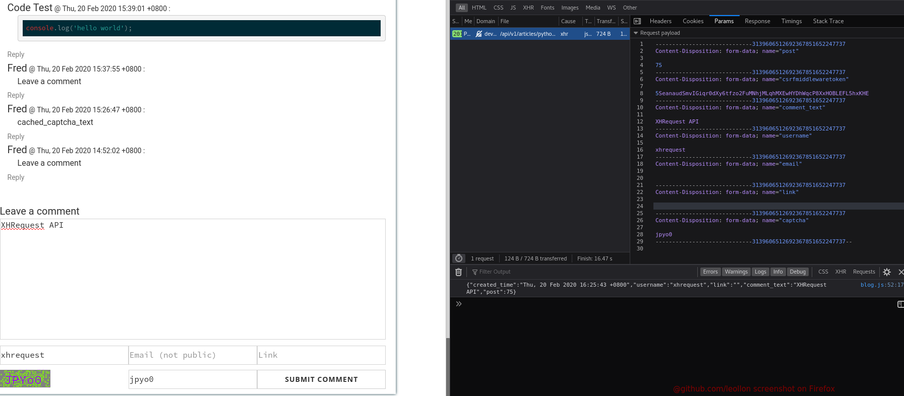
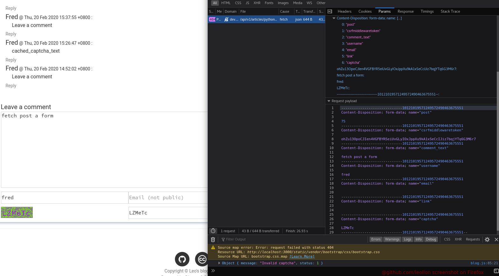
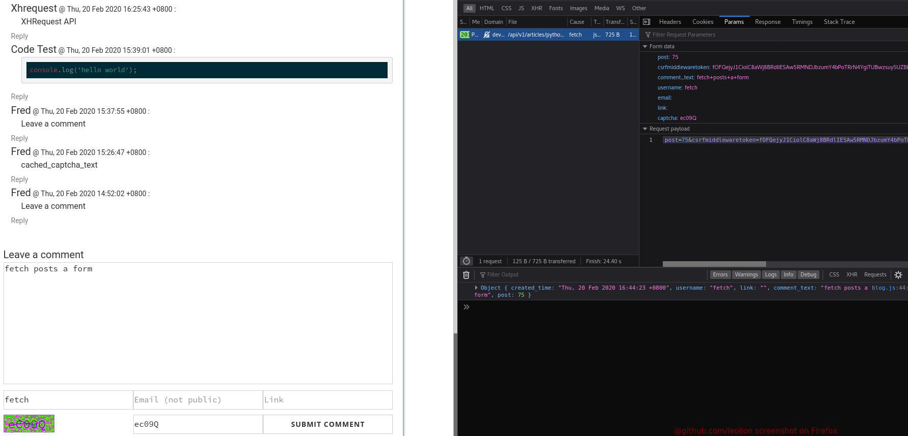

# Fetch API vs XHRequest API

`XHRequest` 使用 `new FormData(document.getElementById("form-id")))` 可以 `POST` 表单数据，
但是`Fetch` 使用 `new FormData(document.getElementById("form-id")))` 不可以 `POST`表单数据。

## 使用 `XHRequest` POST 表单数据

```javascript

const api_host = 'http://example.com';
const commentSubmitButton = document.getElementById("comment-submit-btn");

commentSubmitButton.addEventListener('click', function (event) {
    event.preventDefault();
    let formData = new FormData(document.getElementById("comment-form"));
    const xhRequest = new XMLHttpRequest();
    const article_slug = $("#comment-form").attr('action');
    const url = api_host + '/api/v1/articles' + article_slug + '/comments/';

    xhRequest.onloadend = function (event) {
        console.log(this.response);
    };
    xhRequest.open("POST", url, true);
    xhRequest.send(formData);
})

```

使用 `XHRequest` 提交表单数据后表现为：



可以看到已经成功地提交了表单数据。

## 使用 `Fetch` POST 表单数据

使用 `fetch`提交表单数据后表现为：


使用 `fetch`的代码：

```javascript
const api_host = 'http://example.com';
const commentSubmitButton = document.getElementById("comment-submit-btn");

commentSubmitButton.addEventListener('click', function (event) {
    event.preventDefault();
    let formData = new FormData(document.getElementById("comment-form"));
    const xhRequest = new XMLHttpRequest();
    const article_slug = $("#comment-form").attr('action');
    const url = api_host + '/api/v1/articles' + article_slug + '/comments/';

    fetch(url, {
            method: 'POST',
            mode: 'cors',
            cache: 'no-cache',
            body: formData,
            headers: {
                'Content-Type': 'application/x-www-form-urlencoded',
            },
            redirect: 'follow',
        })
        .then(response => {
            return response.json();
        })
        .then(jsonData => {
            console.log(jsonData);
        }
    );
})
```

开始是没有加上 `Content-Type: 'application/x-www/form-urlencoded'`。所以尝试在 `fetch` 的时候，加上`headers`，如上所示，但错误变现依旧。

花上那么几秒钟搜索引擎，我在搜索框中敲下了 [fetch post a form](https:ww.startpage.com/do/dsearch?query=fetch+post+a+form&cat=web&pl=ext-ff&language=english&extVersion=1.3.0) ，然后瞬间我就打开了新世界。

根据 [@poke](https://stackoverflow.com/a/46642899/8269201) 提供的 solution，需要将

```javascript
let formData = new FormData(document.getElementById("comment-form"));
```

替换为

```javascript
let formData = new URLSearchParams(new FormData(document.getElementById("comment-form")));
```

最后再`fetch` `post` 表单数据即可。




# References

* [搜索引擎关键字：fetch post a form](https:ww.startpage.com/do/dsearch?query=fetch+post+a+form&cat=web&pl=ext-ff&language=english&extVersion=1.3.0)

* [How do I post form data with fetch api?](https://stackoverflow.com/a/46642899/8269201)
